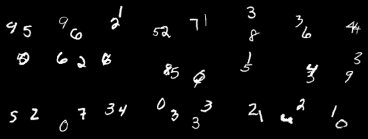

# 0.6M params
596,864 parameters

# 1.24M params

dim_model: 96; mlp_hidden: 256; heads: 1; dim_head: 128; layers: 12; 3d-local-attention-kernel size: (7,3,3); batch_size: 14; steps: 50k; context-frames: 5;

 # 12.26M params 

dim_model: 384; mlp_hidden: 512; heads: 1; dim_head: 128; layers: 20; 3d-local-attention kernel size: (7,3,3); batch_size: 64; context-frames: 5;

command line:
`main.py --ema_decay 0.999 --dim 384 --mlp_dim 512 --heads 1 --depth 20 --batch_size 64 --extent 3,1,1 --name e311_dim384_d20_h1`

git hash: [435e85a](https://github.com/world-modelz/world-modelz/commit/435e85a74e25087c19c8ba7c6b85676663089097)

After 75k steps: 

